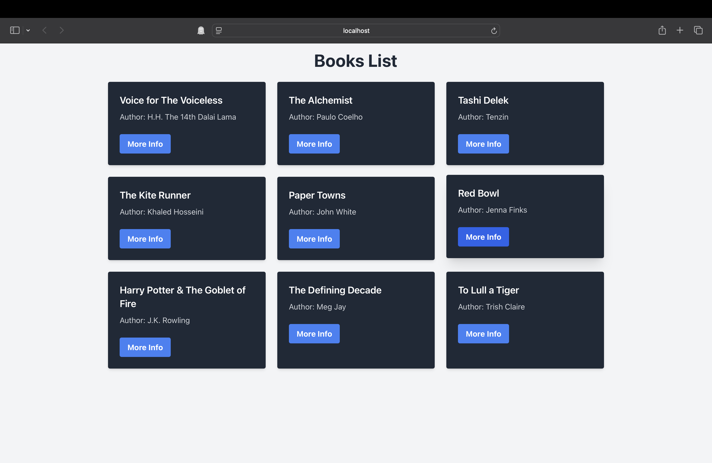
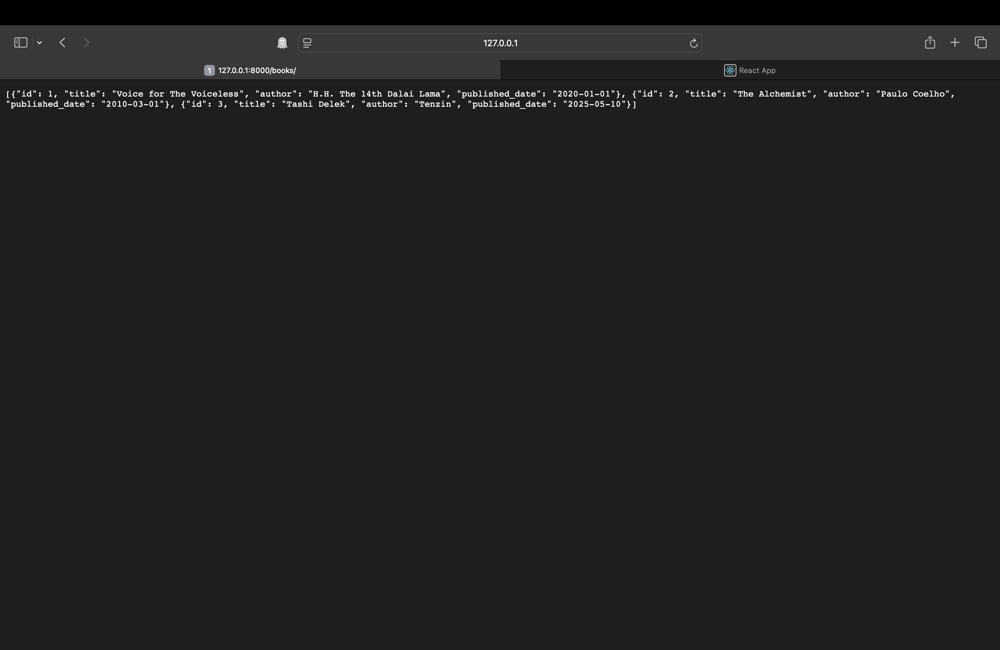

# Practice Project (Django + React + MySQL)

A simple full-stack web application with a **Django backend** connected to **MySQL** and a **React frontend**.  
Currently, the app **fetches and displays a list of books**.

---

## Features
- Django backend serving JSON data  
- MySQL database for storing book data  
- React frontend for displaying books  
- CORS enabled for frontend-backend communication  

---

## Tech Stack
- **Backend**: Django  
- **Database**: MySQL  
- **Frontend**: React (with Axios for API calls)  

---

## Setup Instructions

### 1. Clone the Repository
```bash
git clone https://github.com/your-username/your-repo-name.git
cd your-repo-name
```

### 2. Backend Setup (Django + MySQL)
#### Navigate to the backend folder:
```bash
cd practiceproject
```
#### Create and activate a virtual environment:
```bash
python3 -m venv prenv
source prenv/bin/activate   # Mac/Linux
prenv\Scripts\activate      # Windows
```
#### Install dependencies:
```bash
pip install -r requirements.txt
```
#### Configure MySQL Database in settings.py:
```bash
DATABASES = {
    'default': {
        'ENGINE': 'django.db.backends.mysql',
        'NAME': 'your_db_name',
        'USER': 'your_mysql_user',
        'PASSWORD': 'your_mysql_password',
        'HOST': 'localhost',
        'PORT': '3306',
    }
}
```
#### Run migrations:
```bash
python manage.py migrate
```
#### Start the backend server:
```bash
python manage.py runserver
```

### 3. Frontend Setup (React)
#### Open a new terminal and go to the frontend folder:
```
cd frontend
```
#### Install dependencies:
```
npm install
```
#### Start the React development server:
```
npm start
```

## Screenshots

### React Frontend


### Django Backend


